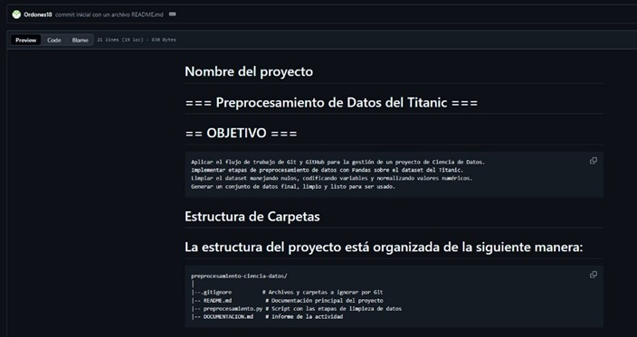
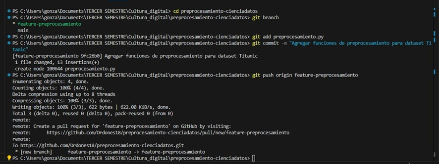
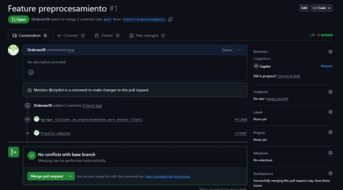
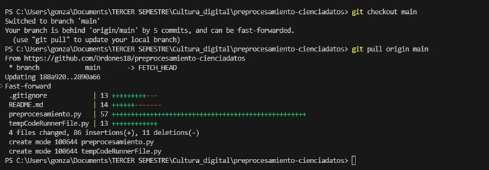
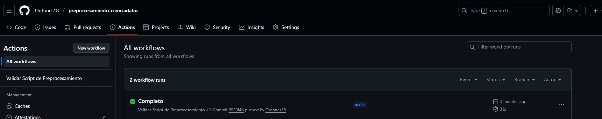

# Informe de Actividad: Control de Versiones y Preprocesamiento de Datos

## 1. Introducción

El objetivo de este proyecto fue aplicar de manera práctica el flujo de trabajo de Git y GitHub para la gestión de un proyecto de Ciencia de Datos. La funcionalidad implementada consiste en un script de Python (`preprocesamiento.py`) que realiza un pipeline completo de limpieza y preparación sobre el dataset del Titanic. Este proceso incluye el manejo de valores nulos, codificación de variables categóricas y normalización de datos numéricos para dejar el dataset listo para su uso en modelos de Machine Learning.

## 2. Comandos Git Usados

A continuación se describen los comandos clave de Git utilizados durante el desarrollo de este proyecto y su propósito:

-   `git clone [URL]`: Clona un repositorio existente desde GitHub a la máquina local para empezar a trabajar.
-   `git add [archivo(s)]`: Añade archivos nuevos o modificados al área de "staging", preparándolos para ser incluidos en el próximo commit.
-   `git commit -m "[mensaje]"`: Guarda una instantánea de los cambios en el historial del proyecto con un mensaje descriptivo.
-   `git push origin [rama]`: Sube los commits locales a la rama especificada en el repositorio remoto de GitHub.
-   `git checkout -b [nombre-rama]`: Crea una nueva rama de trabajo y se cambia a ella, permitiendo desarrollar nuevas funcionalidades de forma aislada sin afectar la rama principal.
-   `git pull origin [rama]`: Descarga los cambios desde el repositorio remoto y los fusiona en la rama local actual, manteniendo el proyecto sincronizado.

## 3. Automatización: Explicación del workflow de GitHub Actions creado

Para este proyecto, se implementó un workflow de Integración Continua  utilizando GitHub Actions. El objetivo de esta automatización es validar que el script `preprocesamiento.py` y sus dependencias se instalen y ejecuten correctamente cada vez que se actualiza el código en la rama principal.

El workflow, definido en el archivo `.github/workflows/python-ci.yml`, realiza los siguientes pasos de forma automática:

1.  **Activación (Trigger):** El proceso se dispara con cada `push` o `Pull Request` hacia la rama `main`.
2.  **Configuración del Entorno:** Se aprovisiona una máquina virtual con Ubuntu, se descarga el código y se configura un entorno de Python 3.10.
3.  **Instalación de Dependencias:** El workflow lee el archivo `requirements.txt` e instala todas las librerías necesarias.
4.  **Ejecución y Validación:** Finalmente, ejecuta el script `preprocesamiento.py`.

Durante la implementación, este workflow **fue importante para detectar un problema de dependencias**. La ejecución inicial falló porque el archivo `requirements.txt` contenía versiones de librerías "fijadas" que no eran compatibles con el entorno de Actions. La solución fue modificar el `requirements.txt` para no especificar versiones, permitiendo que `pip` resolviera las dependencias compatibles automáticamente. La ejecución posterior del workflow fue exitosa, validando el arreglo y garantizando la **reproducibilidad** del proyecto.

## 4. Evidencia del Flujo de Trabajo

A continuación, se presenta la evidencia visual del proceso de desarrollo y gestión de versiones.

### Configuración Inicial y Primer Commit

Se creó el repositorio en GitHub, se configuró el archivo `.gitignore` y se realizó el primer commit con el `README.md` inicial.

---
### Clonar el repositorio para usar el IDE Visual Studio Code

#### Verificamos nuestro usuario y correo de Git Hub

### Desarrollo en Ramas 

Para añadir el script de preprocesamiento, se creó una rama aislada llamada `feature-preprocesamiento` para no afectar la rama principal `main` durante el desarrollo.

---

### Integración con Pull Request y Fusión

Una vez finalizado el script, se abrió un Pull Request en GitHub para proponer la integración de los cambios a la rama `main`. Tras la revisión (simulada), el PR fue fusionado.

---

### Validación Automática con GitHub Actions

Finalmente, el workflow de CI se ejecutó automáticamente tras la fusión, validando que el código integrado en `main` era funcional y pasaba todas las pruebas (instalación y ejecución del script).

