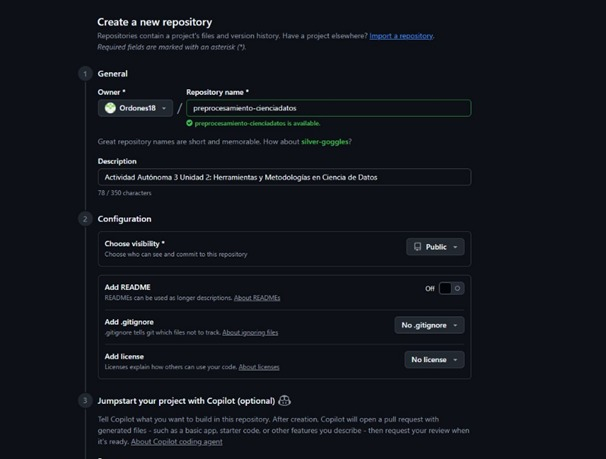

```
# Informe de Actividad: Control de Versiones y Preprocesamiento de Datos

## 1. Introducción

El objetivo de este proyecto fue aplicar de manera práctica el flujo de trabajo de Git y GitHub para la gestión de un proyecto de Ciencia de Datos.
La funcionalidad implementada consiste en un script de Python preprocesamiento.py que realiza un pipeline completo de limpieza y preparación sobre el dataset del Titanic.
Este proceso incluye el manejo de valores nulos, codificación de variables categóricas y normalización de datos numéricos para dejar el dataset listo para su uso en modelos de Machine Learning.

## 2. Comandos Git Usados

A continuación se describen los comandos clave de Git utilizados durante el desarrollo de este proyecto y su propósito:

-   git clone [URL]: Clona un repositorio existente desde GitHub a la máquina local para empezar a trabajar.
-   git add [archivo(s)]: Añade archivos nuevos o modificados al área de "staging", preparándolos para ser incluidos en el próximo commit.
-   git commit -m "[mensaje]": Guarda una instantánea de los cambios en el historial del proyecto con un mensaje descriptivo.
-   git push origin [rama]: Sube los commits locales a la rama especificada en el repositorio remoto de GitHub.
-   git checkout -b [nombre-rama]: Crea una nueva rama de trabajo y se cambia a ella, permitiendo desarrollar nuevas funcionalidades de forma aislada sin afectar la rama principal.
-   git pull origin [rama]: Descarga los cambios desde el repositorio remoto y los fusiona en la rama local actual, manteniendo el proyecto sincronizado.

## 3. Automatización (GitHub Actions)

Para este proyecto, se podría implementar un workflow de GitHub Actions para automatizar la validación del código. Un flujo de trabajo básico consistiría en:

1.  Disparador:Se activaría automáticamente con cada push a la rama main.
2.  Trabajo:  
    -   Configurar un entorno de Python.
    -   Instalar las dependencias del proyecto ejem. pandas, scikit-learn.
    -   Ejecutar el script preprocesamiento.py para asegurar que se completa sin errores.

Este proceso de Integración Continua garantiza que el código en la rama principal siempre sea funcional y cumpla con los estándares de calidad definidos.

## 4. Evidencia y Capturas de Pantalla

A continuación, se presenta la evidencia visual del flujo de trabajo seguido.

```
# Crea un repositorio en GitHub llamado preprocesamiento-cienciadatos

